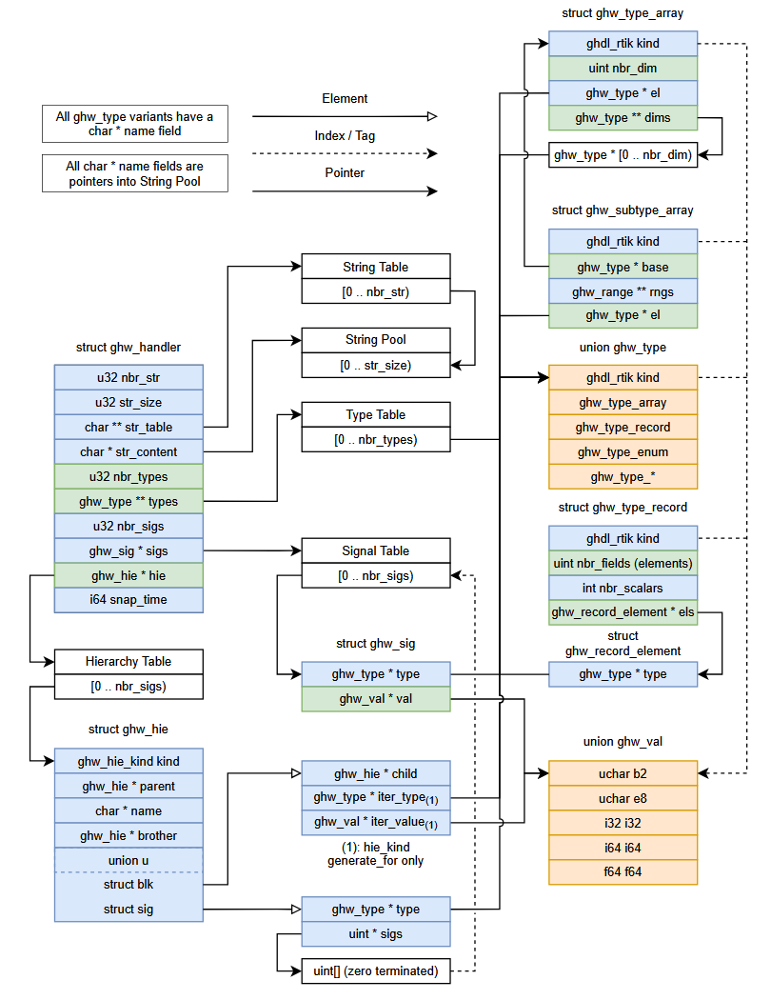

# Libghw-Util

Eventual utilities for reading GHW files. Derived from libghw from GHDL.

# GHW File Format
This is an unofficial documentation of how the GHW file format and libghw work. I was unable to find a complete documentation elsewhere.

## Assumptions
In some places, libghw makes the classic assumption that a char is one byte. This is not correct, but will be adopted for brevity within this documentation. Similarly, where features are present in libghw but no effect is observable, I will assume that it is not used anywhere. Of course, it's possible these features are actually written or read by GHDL or GTKwave.

## Sections
The start of a GHW file contains a 16 byte header, described later.

The end of a GHW file contains a Directory, listing the sections of the file and their file offsets. These are identified by a 3-character (+ zero termination) ID. Additionally, some other tokens appear using the same ID style. These are approximately in order of appearance in a typical file:

* STR: Strings, similar to in an ELF, are pooled in a central location.
* EOS: End of string section
* TYP: Type information
* WKT: "Well-known" types
* HIE: Design hierarchy
* EOH: End of header
* SNP: Snapshot section, contains the current values of design signals
* ESN: End of snapshot
* CYC: Cycles section
* ECY: End of cycles section
* DIR: Directory section
* EOD: End of directory
* TAI: Tail section

Libghw does not read this format by reading the header and then jumping to the directory at the end. There's also not a totally safe way to jump to the directory, I.e. other than scanning for the DIR string, which could hit other data.

## Ghw_handler Struct


## Header
All files start with the string "GHDLwave\n", no zero termination.
Offsets 9, 10, and 11 contain version info. Libghw only accepts values 16, 0, 0, respectively.
Offset 12 indicates if the file is little-endian or big endian. (1 = little, 2 = big)

These are not used for anything in libghw:
Offset 13 is "word_len"
Offset 14 is "off_len"

Offset 15 must be zero.

## Types Section


## Hierarchy Section
The hierarchy section starts with a 16 byte header. The first 4 bytes must be zero. A 4 byte number of "scopes" follows, then an 4 byte number of signals. Then a 4 byte number of *basic* signals. This is the number of signals when all signals are dismantled into scalars, I.e. records and arrays taken apart into individual signals. This last value is nbr_sigs and will be important for the CYC section. One ghw_sig is callocated for each of these signals, plus an extra to act like a null terminator.

The type of each hierarchy element is encoded in one byte, defined by ghw_hie_kind. Each element is mallocated and linked into a tree. Each hierarchy name is read from the STR pool via an index. Generate statements have extra encoding. Hierarchy elements are a union depending on whether they contain a signal with a type and value. The types are signals are ghw_hie_signal and all ghw_hie_port_*. Signals are encoded with a type id (an index to the TYP section), and a number of elements for arrays.

Once this section is read, there is one ghw_sig for each signal in the entire hierarchy. Each is a struct with a pointer to its type, and another pointer to its current value. Only one value is present in the handle at a time, it does not keep the full timeline of any signal.

## Snapshot Section
The snapshot section starts with a 12 byte header. The first four bytes must be zero. The next 8 bytes encode the current simulation time. The list of the signal values follows. The section must end with the ESN token.

## Cycles Section
The first SNP section is the start of a region that constitutes a list of "sm", which I will speculate means Simulation Marker. An sm may be a SNP, CYC, DIR, or TAI.

The call tree for this part is confusing, so here is a summary:
```
ghw_read_sm
	if sm == ghw_sm_init or ghw_sm_sect ->

		res = ghw_read_sm_hdr()
		switch on the next 4 bytes in file
			"SNP" -> ghw_read_snapshot()
				sm = ghw_sm_sect
			"CYC" ->
				ghw_read_cycle_start()
				ghw_read_cycle_cont()
				sm = ghw_sm_cycle
			"DIR" ->
				return ghw_read_directory()
			"TAI" ->
				return ghw_read_tailer()

			Other paths are all error

	if sm == ghw_sm_cycle
		switch ghw_read_cycle_next()
			<0 -> error
			1 -> ghw_read_cycle_cont()
			>1 -> ghw_read_cycle_end(), sm = ghw_sm_sect
```

Based on this flow, the CYC section can be said to contain subsections of type Start, Next, and Cont, based on the functions ghw_read_cycle_* functions with those suffixes.
* Start: Read a 64 bit initial simulation time
* Next: Increment the simulation time. The special value -1 is used to mark the end of the simulation.
* Cont: Update signal values which have changed

Each signal (which takes a new value only?) is indexed via delta offsets in the sigs array. The new value of the signal follows. Note that ghw_read_cycle_cont both updates the signal values in the sigs array, and outputs a zero-terminated list of indices which were updated. The latter is a pointer always passed as null and thus not used.

## Signal Values
Values may be encoded in multiple ways, depending on their type.

## Endianness
I currently have no way to check if libghw handle endianness correctly. I am inclined to think it doesn't, purely based on source comments.

## Opinions
Unless im misunderstanding something, this format makes it somewhat difficult to get a time range of a specific signal, which happens to be my use case. On the other hand, this format makes writing, and particulary piping from a sim to a viewer easy. Since my use case involves reading already-finished sims, it should be easy to create a new data structure that indexes signals in a way I like, provided the CYC section has been scanned beyond the desired end time once.
